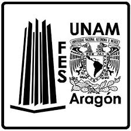

# Cristóbal Miranda Hernández
## Computadoras y Proramación Grupo 1157
## Semestre 2020-1


Aqui va una **descripción** del *repositorio*
- Elemento 1
- Elemento 2
- Elemento 3

```
num = 10
print("num vale = ", num)
```
